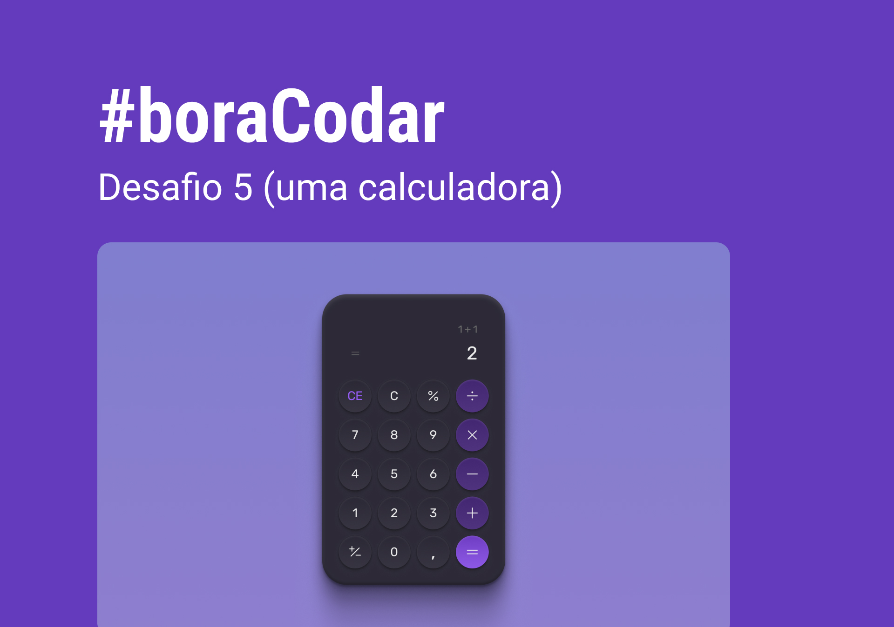

<h1 align="center"> Calculadora </h1>

Projeto desenvolvido no desafio do #boraCodar da Rocketseat, o objetivo era desenvolver uma Calculadora. 

  <a href="#-tecnologias">Tecnologias</a>&nbsp;&nbsp;&nbsp;|&nbsp;&nbsp;&nbsp;
  <a href="#-projeto">Projeto</a>&nbsp;&nbsp;&nbsp;|&nbsp;&nbsp;&nbsp;
  <a href="#-layout">Layout</a>&nbsp;&nbsp;&nbsp;|&nbsp;&nbsp;&nbsp;
  <a href="#memo-licença">Licença</a>

  

  <table>
    <tr>
      <th>🚩 INICIADO</th>
      <th>✅ FINALIZADO</th>
    </tr>
    <tr>
      <td>05/02/2023</td>
      <td>06/02/2023</td>
    </tr>
  </table>

 

  

---

## 🚀 Tecnologias

Esse projeto foi desenvolvido com as seguintes tecnologias:

- HTML e CSS
- Javascript
- Git e Github
- Figma

## 🔖 Layout

Você pode visualizar o layout do projeto através [DESSE LINK](https://www.figma.com/file/d0o6RztfbCcI9R0hSgn7la/boraCodar-Desafio-5-Community). É necessário ter conta no [Figma](https://figma.com) para acessá-lo.

## :memo: Licença

Esse projeto está sob a licença MIT.
